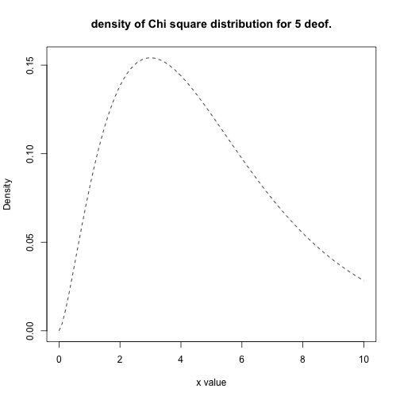

## Brief introduction

<!--1. Description of the program, user guide-->
1. The randomness of sequences produced by computer is an old an fascinating problem.
2. Computers usually can produce only the pseudo-random sequence. These days there are special hardware components that can produce truly random numbers by the use of quantum mechanics.
3. The question whether brain could produce really random sequence is fascinating because it could have deep philosophical meanings. Is the brain also somehow quantum?...
4. This project was motivated by author's interest in the above questions.

--- .class #id 

## Technical details
### Description of the program, user guide 
1. Fill out the numerical inputs called "Numerical Input 1" to "Numerical Input 10" by a Natural numbers.
2. Each column should contain one continuous string of numerals.
3. The order of each numeral should be of the order of $10^8$.
4. Even if the sequence is not all numerical, i.e. there are some incorrect characters, like letters. The program will later disregard non-numerical ones and notify the user.
5. After filling up all the input lines. User should press the GO! button.
6. The histogram of the numerical sequence entered is shown in the same windows. 
7. The statistics is shown in the separate windows called "Summary".
8. For the users convenience there is also the section "Documentation".

--- 
## Technical details
### Description of the program, estimation of randomness
1. The randomness of the finite sequence is theoretically described by the "Kolmogorov complexity"
2. Briefly, the "Kolmogorov complexity" with respect to some programming language **p** is the length of the smallest program that reproduces the sequence
3. To find the Kolmogorov complexity is an NP hard, unless $P=NP$.
4. We estimate the randomness of the sequence by easier to calculate $\chi^2$ test.
5. The p values are compared at the standard $0.05$ level.

---

## Example of Chi square distribution


```r
x <- seq(0, 10, length=100)
hx <- dchisq(x,df=5)
plot(x, hx, type="l", lty=2, xlab="x value",
    ylab="Density", main="density of Chi square distribution for 5 deof.")
```

 
---


